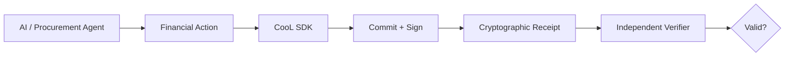

# CooL Agent Receipts

> ### When AI moves money, who can prove what it actually did?

**CooL Agent Receipts** is a cryptographic evidence layer for AI agents executing high-consequence actions.

The MVP demonstrates this through a simulated procurement agent executing a ₹2,500 vendor payment — generating a cryptographically verifiable receipt that can later be independently checked and deliberately tampered with to demonstrate verification failure.

<p align="center">

**[▶ LIVE DEMO](https://cool-agent-receipts.vercel.app)**

</p>

---

## The Problem

AI agents are moving beyond answering questions.

They are beginning to **take actions**.

A financial agent may:

- select a vendor
- authorize a payment
- initiate a refund
- interact with procurement systems
- execute actions across enterprise software

That creates a new accountability problem:

> **When an AI agent moves money, what evidence remains when someone asks: "What exactly did it do?"**

Traditional logs are useful for operations, but they are usually controlled by the same application that produced them.

A screenshot can show what a system displayed, but it does not independently establish that the underlying evidence has not been altered.

As autonomous agents become capable of executing consequential actions, organizations need an evidence layer that can be independently verified.

---

# The Solution

## CooL Agent Receipts

CooL creates a cryptographic receipt around an agent execution.

Instead of relying only on:

```text
AI Agent
   ↓
Application
   ↓
Database Log
   ↓
"Trust the system"
```

CooL introduces:

```text
AI Agent
   ↓
Financial Action
   ↓
CooL SDK
   ↓
Commit + Sign
   ↓
Cryptographic Receipt
   ↓
Independent Verification
```

The goal is simple:

> **Reduce the amount of trust required in the system producing the record.**

---

# What The MVP Demonstrates

The live prototype simulates a procurement agent executing a financial action.

### Scenario

```text
Agent:        Procurement Agent v3
Counterparty: Acme Supplies
Action:       PAYMENT
Amount:       ₹2,500
```

The application then:

1. Records the execution through the CooL SDK.
2. Generates a cryptographic evidence receipt.
3. Displays the receipt and its verification-related fields.
4. Allows the evidence to be deliberately modified.
5. Sends the modified evidence back through the verifier.
6. Demonstrates that the altered evidence is rejected.

### The critical demonstration

```text
Original Evidence
       ↓
   VERIFY
       ↓
    VALID

        │
        │ modify evidence
        ▼

Tampered Evidence
       ↓
   VERIFY
       ↓
   REJECTED
```

This demonstrates the core concept:

**Changing the recorded evidence breaks its cryptographic integrity.**

---

# Try It Yourself

## 60-Second Demo

Open:

**https://cool-agent-receipts.vercel.app**

### 1. Execute a payment

Click:

```text
EXECUTE PAYMENT
```

A new cryptographic receipt is generated.

### 2. Open the Receipts ledger

You should see the generated receipt.

### 3. Inspect the receipt

The receipt exposes information including:

- Evidence ID
- Execution ID
- Timestamp
- Binding Hash
- Metadata Hash
- Schema
- Raw Evidence

### 4. Open Tamper Demo

Modify the evidence.

For example:

```text
₹2,500
   ↓
₹25,000
```

### 5. Verify

Click:

```text
TAMPER RECEIPT
```

The verifier should reject the modified evidence.

The expected result is:

```text
VERIFICATION FAILED
```

---

# How It Works

CooL follows a simple evidence pipeline:

```text
OBSERVE
   ↓
COMMIT
   ↓
SIGN
   ↓
ATTEST*
   ↓
ANCHOR*
   ↓
VERIFY
```

\* Availability of hardware attestation / external anchoring depends on the underlying deployment and configuration.

At the application layer, the prototype records an execution event through the CooL SDK.

The resulting evidence contains cryptographic information that allows the verifier to test whether the evidence remains consistent with what was originally recorded.

---

# Cryptographic Evidence

The underlying CooL SDK provides primitives for creating independently verifiable execution evidence.

The evidence model includes concepts such as:

- deterministic commitments
- cryptographic binding
- digital signatures
- execution identity
- event identity
- metadata commitments
- transparency-log structures
- verification of the resulting evidence

The SDK uses a hybrid cryptographic model including:

- **ML-DSA-65**
- **Ed25519**

The receipt does not need to expose sensitive application data as plaintext. Event metadata can instead be represented through cryptographic commitments/hashes.

---

# What CooL Proves

CooL is designed to provide evidence about the integrity and provenance of an execution record.

Depending on the configured evidence path, it can provide evidence relating to:

### Software / execution

- which application generated the record
- execution identity
- recorded event type

### Evidence integrity

- cryptographic binding of recorded information
- signature verification
- detection of modified evidence

### Transparency

- evidence associated with append-only transparency structures where configured

### Hardware attestation

- hardware-backed execution evidence where a real supported TEE/attestation environment is actually used

---

# What CooL Does NOT Prove

This distinction is fundamental.

A valid cryptographic receipt does **not** automatically mean that the underlying action was correct.

CooL does **not** by itself prove:

- that the AI made the correct decision
- that the payment was legally authorized
- that the payment actually settled
- that the underlying data was truthful
- that the AI was safe or unbiased
- that the software was bug-free
- that an organization is legally compliant
- that the system is impossible to compromise

In other words:

> **CooL provides evidence integrity — not truth about the entire outside world.**

---

# Architecture



## Application Architecture

```text
                    ┌─────────────────────┐
                    │    React / Vite     │
                    │      Frontend       │
                    └──────────┬──────────┘
                               │
                               │ HTTP
                               ▼
                    ┌─────────────────────┐
                    │   Express Backend   │
                    │      server.ts      │
                    └──────────┬──────────┘
                               │
                               ▼
                    ┌─────────────────────┐
                    │      CooL SDK       │
                    │      cool-nwc        │
                    └──────────┬──────────┘
                               │
                               ▼
                    ┌─────────────────────┐
                    │ Cryptographic       │
                    │ Evidence / Receipt  │
                    └──────────┬──────────┘
                               │
                               ▼
                    ┌─────────────────────┐
                    │ Independent         │
                    │ Verification        │
                    └─────────────────────┘
```

---

# API

The MVP exposes two core application endpoints.

## Execute Payment

```http
POST /api/execute-payment
```

Creates the simulated payment execution and returns the generated receipt.

## Verify Evidence

```http
POST /api/verify
```

Accepts evidence and returns the verification result.

The frontend uses the same-origin API paths in production, allowing the live application to operate as a single deployed experience.

---

# Project Structure

```text
cool-agent-receipts/
│
├── api/
│   └── index.ts
│
├── frontend/
│   ├── src/
│   │   ├── App.tsx
│   │   └── index.css
│   ├── index.html
│   └── package.json
│
├── public/
│
├── server.ts
├── package.json
├── package-lock.json
├── vercel.json
└── README.md
```

---

# Technology

Built with:

- **TypeScript**
- **React**
- **Vite**
- **Express**
- **CooL SDK (`cool-nwc`)**
- **Vercel**

The cryptographic evidence layer is provided by the CooL SDK.

---

# Local Development

## Requirements

- Node.js
- npm

## Install

```bash
npm install
```

## Run the backend

```bash
npm run dev:backend
```

The Express backend runs locally on port `3001`.

## Build the frontend

```bash
npm run build
```

The build process compiles the frontend and prepares the production static output.

---

# Why Financial Agents First?

Financial execution is a useful first application because the consequences of an autonomous action are concrete.

A single agent action can create:

```text
Financial Exposure
       +
Operational Accountability
       +
Audit Questions
       +
Dispute Risk
```

The initial product therefore focuses on actions such as:

- payments
- procurement
- accounts payable
- refunds
- subscriptions
- card transactions
- agentic payment workflows

The evidence layer itself is not limited to payments.

---

# Market Direction

The emergence of agentic commerce creates a new infrastructure question.

Payment networks and financial systems can provide mechanisms for **authorization and transaction execution**.

CooL approaches a different layer:

> **What evidence can an organization independently verify about what the agent actually executed?**

The long-term opportunity is therefore not to replace payment rails.

It is to become an **evidence layer for autonomous software actions.**

---

# Future Scope

## Financial Agents

Expand from the current prototype toward:

- procurement agents
- accounts-payable agents
- refund agents
- subscription agents
- card agents
- agentic payment infrastructure

## Enterprise Systems

Extend evidence capture to:

- ERP actions
- approval workflows
- financial operations
- audit investigations
- dispute resolution

## Beyond Finance

The same model can eventually apply wherever autonomous software performs high-consequence actions:

```text
Financial Actions
       ↓
Enterprise Actions
       ↓
High-Consequence Agent Actions
```

The underlying idea remains the same:

> **If software can act autonomously, there should be a way to produce independently verifiable evidence of that action.**

---

# Trust Model

Traditional model:

```text
Application
     ↓
Database
     ↓
Application UI
     ↓
"Trust us"
```

CooL model:

```text
Application
     ↓
Cryptographic Evidence
     ↓
Independent Verifier
     ↓
Mathematical Verification
```

The purpose is not to eliminate trust entirely.

It is to move part of the trust question from:

**"Do we trust the system that produced this record?"**

toward:

**"Does the evidence cryptographically verify?"**

---

# Demo Limitations

This repository is a **hackathon MVP**.

The payment scenario is simulated. The application demonstrates the evidence-generation and verification workflow; it is not connected to a live banking account or payment rail.

Where the interface displays simulated hardware-attestation information, it must be understood as **simulation**, not proof of execution inside physical trusted hardware.

The prototype should therefore not be interpreted as production-ready financial infrastructure.

---

# The Core Idea

AI agents are gaining the ability to act.

That changes the infrastructure problem.

We already have systems that can:

```text
DECIDE
  ↓
ACT
  ↓
MOVE MONEY
```

The missing question is:

```text
DECIDE
  ↓
ACT
  ↓
MOVE MONEY
  ↓
PROVE WHAT HAPPENED
```

**CooL Agent Receipts is an attempt to build that evidence layer.**

---

## Built for the Reverse Hackathon

**CooL Agent Receipts**

> **When AI moves money, who can prove what it actually did?**

**Live Demo:**  
https://cool-agent-receipts.vercel.app

**Repository:**  
https://github.com/roniee071-hub/Cool-agent-receipts
